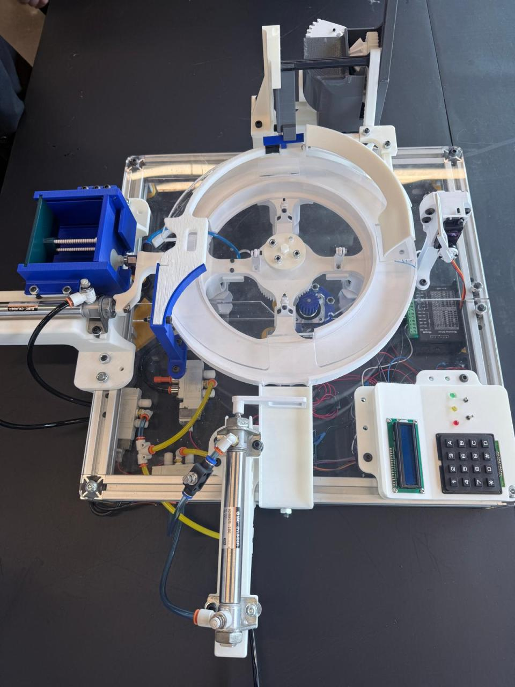
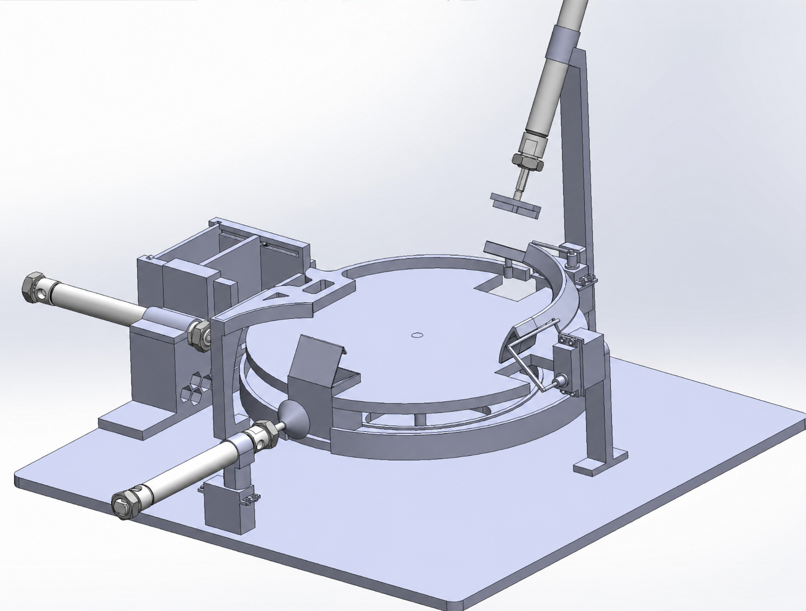

# 📦 Automated Box Cartooning Machine
### Embedded Mechatronics System — Tiva C Microcontroller, Pneumatics, SolidWorks & AutoCAD


---

## 📌 Overview

A fully automated, low-cost **box cartooning machine** designed and built from scratch for small to medium-sized manufacturers. The system autonomously picks, rotates, folds, and locks cardboard box flaps using a custom-designed mechatronics system — all controlled by a single **TM4C123 microcontroller**.

Built for *MENG-2500 Mechatronics Project* at Humber Polytechnic — Winter 2025.

> 👩‍💻 **Author:** Tanvi Bhanderi — Mechatronics Engineering

---

## 🖼️ System Demo

| Physical Build | SolidWorks Assembly |
|---|---|
|  |  |

---

## ✨ Key Features

- ✅ **4-phase automated operation** — pick, rotate, fold, lock
- ✅ **Closed-loop control** via ultrasonic sensor feedback
- ✅ **Operator interface** — 4×4 keypad + 16×2 I2C LCD display
- ✅ **Pneumatic actuation** — double-acting cylinders + vacuum suction cup
- ✅ **Custom SolidWorks design** — fully 3D printed and assembled
- ✅ **Under $300 budget** — scalable for real manufacturing use

---

## 🏗️ System Architecture

```
Operator Input (Keypad)
        │
        ▼
TM4C123GH6PM Microcontroller
        │
   ┌────┼──────────────────────────────┐
   │    │                              │
   ▼    ▼                              ▼
Stepper  Servo Motors (x2)      Solenoid Valves
Motor    (Flap Folding)         (Pneumatic Control)
   │                                   │
   ▼                                   ▼
Revolving Disc              Double-Acting Cylinders
(Box Transport)             + Venturi Vacuum Cup
                                       │
                            ┌──────────┴──────────┐
                            ▼                     ▼
                       Box Pickup            Box Ejection
                       
        ↑ Ultrasonic Sensor (HC-SR04) — position feedback
        ↑ LCD Display — status output
```

---

## ⚙️ 4-Phase Operation

| Phase | Action | Actuators Used |
|---|---|---|
| **Phase 1** | Box blank pickup from stack | Vacuum cup + pneumatic cylinder |
| **Phase 2** | Box transport & rotation | NEMA 17 stepper + revolving disc |
| **Phase 3** | Flap folding | MG996R servo motors |
| **Phase 4** | Flap locking & ejection | Pneumatic cylinder |

---

## 🔧 Technical Components

### Electrical

| Component | Part | Function |
|---|---|---|
| Microcontroller | TM4C123GH6PM (Tiva C) | Main logic & control |
| Stepper Motor | NEMA 17 + DM542 Driver | Revolving disc rotation |
| Servo Motors | MG996R (×2) | Flap folding mechanism |
| Sensor | HC-SR04 Ultrasonic | Object detection & positioning |
| Display | I2C LCD 16×2 | Status & user feedback |
| Input | 4×4 Matrix Keypad | Box count & operator control |
| Power | LM2596 Buck Converter | 5V regulation for logic components |
| Switching | 5V Relay Module | Solenoid valve control |

### Pneumatic

| Component | Spec | Function |
|---|---|---|
| Double-Acting Cylinders | Bore: 0.75in, Stroke: 4in | Box pickup & ejection |
| 5/2 Solenoid Valve | Spring return | Airflow direction control |
| Venturi Vacuum Generator | Compressed air powered | Suction generation |
| Flat Suction Cup | 25mm | Grips flat cardboard blank |

---

## 🖥️ SolidWorks Design

The full machine was designed in **SolidWorks** before fabrication. Parts were 3D printed and assembled on an aluminum extrusion frame.

### Assembly Structure

```
FINAL MAIN ASSEMB.SLDASM
├── REVOLVING DISC ASSEMB.SLDASM     — central rotating platform
├── PHASE_1.SLDASM                   — pickup mechanism
├── PHASE 2 ASSEMB.SLDASM            — transport & rotation
├── LOCK FOLDING ASSEMB.SLDASM       — flap folding arms
├── PHASE 4 ASSEMB.SLDASM            — ejection mechanism
├── BASE EXTRUSION ASSEMB.SLDASM     — aluminum frame base
└── CONTROL_INTERFACE.SLDPRT        — keypad/LCD panel
```

> The full SolidWorks assembly (`.SLDASM`) and all part files (`.SLDPRT`) are included in this repository.

---

## 📐 AutoCAD Manufacturing Drawings

All machine parts were drafted in **AutoCAD** for precise fabrication before being built. The `.DWG` files contain dimensioned 2D drawings used for laser cutting and CNC machining.

| File | Part |
|---|---|
| `final_box_cut_out.DWG` | Box blank cutout template |
| `MAIN_REVOLVING_DISC.DWG` | Central rotating disc |
| `LOWER_BASE_HALF.DWG` | Base plate — lower half |
| `LOWER_BASE_HALF_2.DWG` | Base plate — lower half variant |
| `TOP_BASE_CI_SIDE.DWG` | Top base — cylinder interface side |
| `TOP_BASE_MOTOR_SIDE.DWG` | Top base — motor mount side |
| `MOTOR_PLATE.DWG` | Stepper motor mounting plate |

---

## 📁 Repository Structure

```
📦 automated-box-cartooning-machine/
├── 📁 firmware/
│   └── main.c                       # Tiva C embedded C firmware
├── 📁 autocad/
│   ├── final_box_cut_out.DWG        # Box blank cutout template
│   ├── MAIN_REVOLVING_DISC.DWG      # Revolving disc drawing
│   ├── LOWER_BASE_HALF.DWG          # Base plate drawings
│   ├── LOWER_BASE_HALF_2.DWG
│   ├── TOP_BASE_CI_SIDE.DWG         # Top base drawings
│   ├── TOP_BASE_MOTOR_SIDE.DWG
│   └── MOTOR_PLATE.DWG              # Motor mount plate
├── 📁 assets/
│   ├── machine_photo.jpg            # Physical build photo
│   ├── solidworks_render.jpg        # SolidWorks assembly render
│   └── circuit_schematic.jpg        # Circuit wiring diagram
├── [SolidWorks .SLDPRT / .SLDASM files]
├── 📄 Final_Project_Report.pdf
└── 📄 README.md
```

> Open `FINAL MAIN ASSEMB.SLDASM` as the top-level SolidWorks assembly. Firmware compiles in Keil uVision or TI Code Composer Studio targeting TM4C123GH6PM.

---

## 🚀 Build & Flash Firmware

```bash
# Open in Keil uVision or TI Code Composer Studio
# Target: TM4C123GH6PM @ 16 MHz

# 1. Open firmware/main.c
# 2. Add TM4C123GH6PM.h to project (TI DriverLib or CMSIS)
# 3. Build → Flash via ICDI debugger on LaunchPad
```

**Key firmware functions:**

| Function | Description |
|---|---|
| `RotateMotor(angle, speed, dir)` | Steps NEMA 17 by exact degrees |
| `Servo_Set_Angle(pulse, pin)` | PWM bit-bang to MG996R servo |
| `DCV_Set(mask)` | Controls solenoid valves (active-low) |
| `Delay_MicroSecond(time)` | Hardware Timer1A precision delay |

---


- Designing a **multi-subsystem mechatronics machine** from concept to physical build
- Programming **embedded C++** on a TM4C123 microcontroller — timers, GPIO, PWM, UART
- Integrating **pneumatic systems** with electronic control — solenoid valves, cylinders, vacuum
- Building a full **SolidWorks assembly** with 40+ custom parts, designed for 3D printing
- Creating **AutoCAD manufacturing drawings** (`.DWG`) with dimensions for fabrication
- Implementing **closed-loop feedback** using ultrasonic sensors for position detection
- Working within a **$300 hardware budget** — component selection, sourcing, and tradeoffs

---

## 🔮 Future Improvements

- Add **IoT remote monitoring** for production tracking
- Implement **parameterized box sizing** — adjustable for multiple carton dimensions
- Replace open-loop stepper with **encoder feedback** for precise positioning
- Add **fault detection** — jam detection and automatic recovery logic

---

## 📚 References

- TM4C123GH6PM Datasheet — Texas Instruments
- MG996R Servo Datasheet — Tower Pro
- HC-SR04 Ultrasonic Sensor Datasheet — SparkFun
- NEMA 17 + DM542 Driver Documentation
- Humber Polytechnic MENG-2500 — Mechatronics Project, Winter 2025

---

<p align="center">
  Built by Tanvi Bhanderi · Humber Polytechnic — Mechatronics Engineering
</p>
